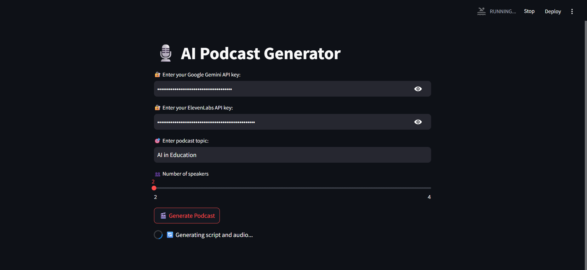
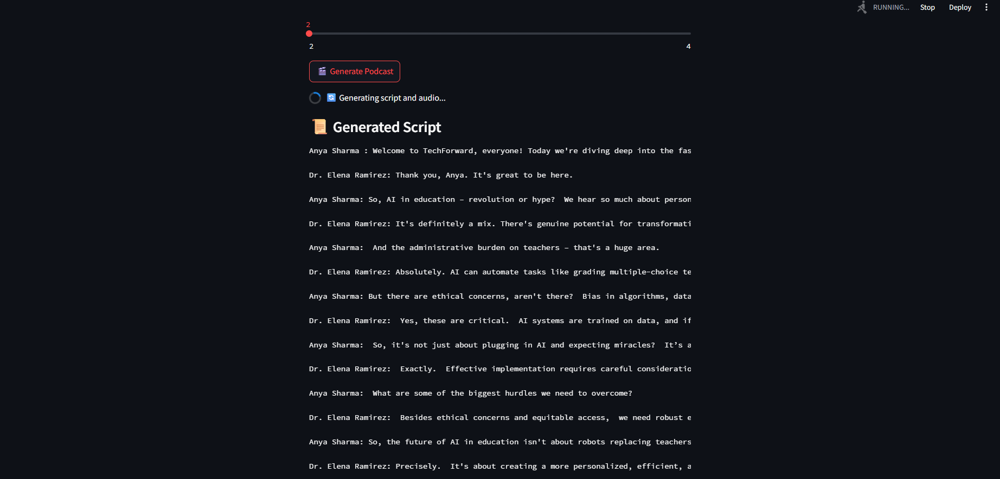
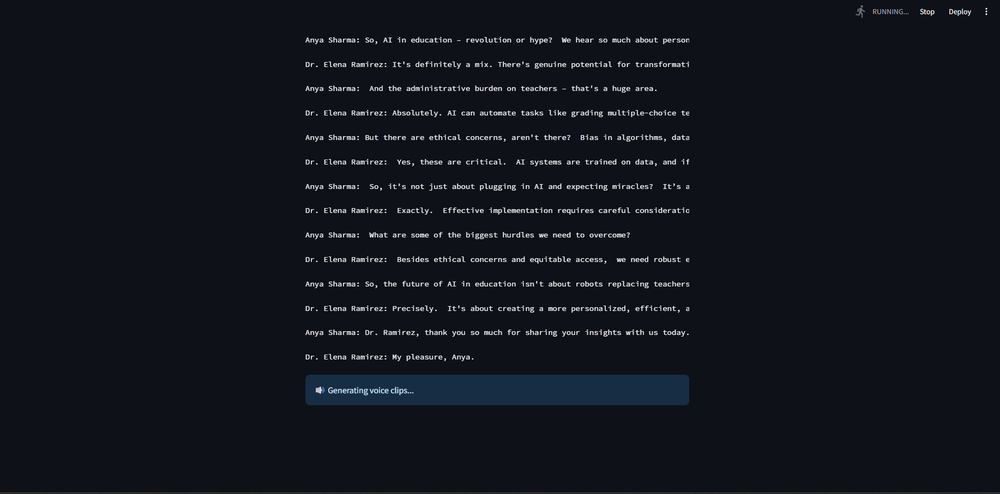
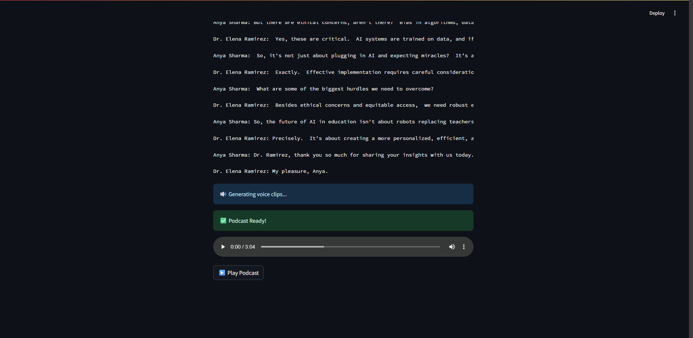

# 🎙️ AI Podcast Generator

> Auto-generate realistic, multi-speaker podcasts using **Google Gemini** + **ElevenLabs** APIs.  
> Two versions included: `top/` (CLI) and `light/` (Streamlit UI).

---

## ✨ Features

- 🔍 Fetches rich, structured content via **Google Gemini**
- 🗣️ Auto-generates human-like podcast scripts
- 🧠 Synthesizes lifelike voices via **ElevenLabs**
- 💡 Supports multiple speaker voices
- 🎛️ Web UI (Streamlit) for interactive use
- 📁 Outputs podcasts as `.mp3` clips and merged audio

---

## 🧩 Tech Stack

- Google Gemini API
- ElevenLabs API
- Streamlit
- Python 3.10+
- Pydub (audio processing)

---

## 🧪 Project Variants

### 1️⃣ `top/` – CLI Version
- Command-line script
- Generates podcast from static topic
- Uses ElevenLabs for voice clips
- Saves `.mp3` files locally

### 2️⃣ `light/` – Streamlit App
- Full interactive web UI
- Input API keys, topic, number of speakers
- View generated script
- Listen to and download the final podcast

---

## 🚀 Getting Started

### 🔧 Requirements

```bash
pip install -r requirements.txt
```

**Note:** Install [FFmpeg](https://ffmpeg.org/download.html) and set its path in your environment if you're using `pydub`.

---

### 🔑 Setup API Keys

Add your API keys into the code or via environment variables:

```bash
GOOGLE_GEMINI_API_KEY="your_gemini_key"
ELEVENLABS_API_KEY="your_elevenlabs_key"
```

---

### ▶️ Run CLI Version (`top/`)

```bash
cd top/
python podcast.py
```

---

### 🌐 Run Streamlit App (`light/`)

```bash
cd light/
streamlit run app.py
```

---

## 📂 Output Example

- 🎧 Individual clips: `clips/1.mp3`, `clips/2.mp3`, ...
- 🎵 Merged final podcast: `clips/merged_podcast.mp3`

---

## 📸 Streamlit App – Screenshots

###  1


### 2


### 3


### 4



---

## 🧠 Example Prompt

```
Topic: AI in Education
Speakers: 4 (e.g., Anya Sharma, Ben Carter, etc.)
```

✅ Output includes:
- Natural host/guest intros  
- Scripted human-style dialogue  
- Realistic voiceover per speaker  
- Playable audio in-browser

---

## 🛡️ Disclaimer

- This is a demo project for learning and exploration.
- Ensure your API keys are stored securely.
- Usage of Gemini and ElevenLabs APIs may incur costs.

---

## 🙌 Credits

- [Google Gemini](https://ai.google.dev/)
- [ElevenLabs](https://www.elevenlabs.io/)
- [Streamlit](https://streamlit.io/)
- [Pydub](https://github.com/jiaaro/pydub)

---

## 📜 License

MIT License © 2025 [Yash Pasalkar](https://github.com/Comp-Yash)
